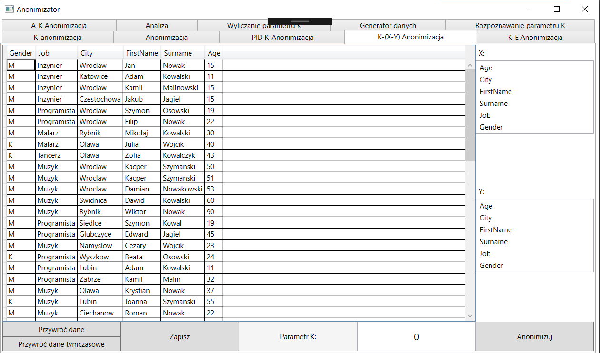
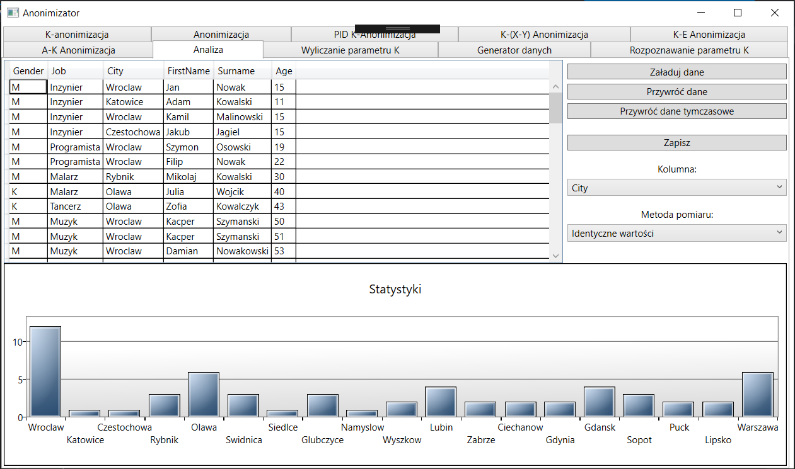
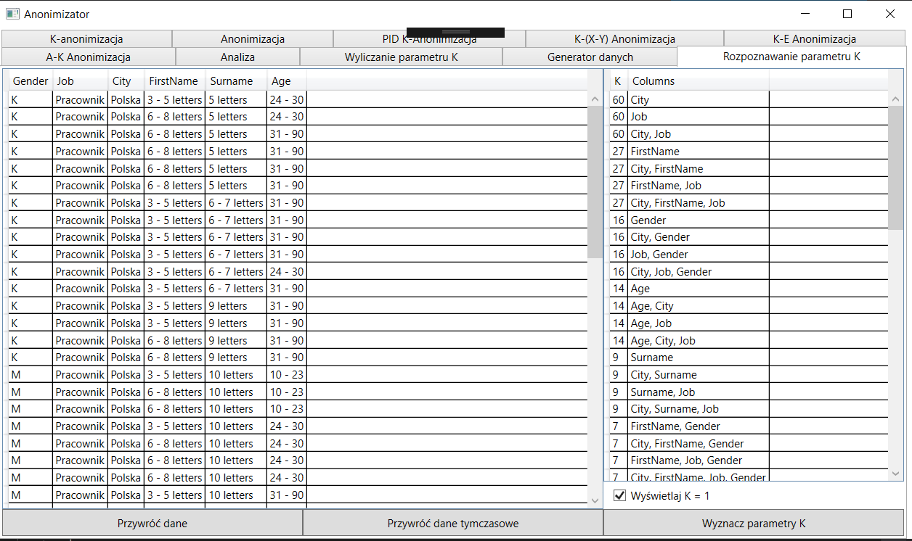

# Anonimizator

## Implementation of various methods of table anonimization:
- K-anonymity
- (X-Y)-anonymity
- Alpha-K-anonymity
- Epsilon-K-anonymity

As in general problem of optimal database anonimization (keeping as much information as possible, while still being anonimized) is NP-hard we used different techniques of anonymizing a single column to achive goal of aformentioned algorithms:
- Attribute suppression
- Generalization
- Partial text masking
- Dictionary generalization

More detailed description of all algoirthms is available on  (polish).

Each algorithm has dedicated screen allowing to set different parameters. Here is a screenshot of X-Y anonymity view.

Project also consits of statystical analysis of table data, which can help in detecting table anonymization techniques and parameters.

